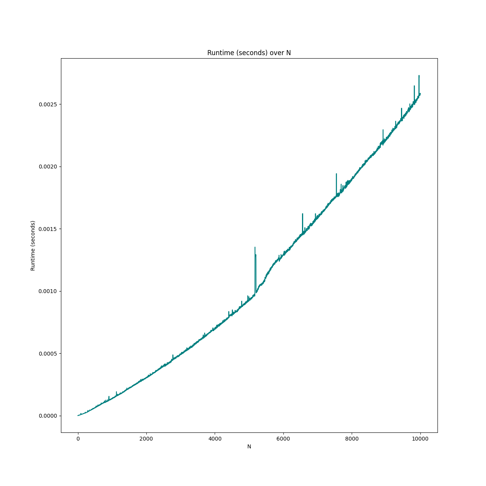

# Requirements
- Python 3.12
- Unix system (Mac OS or Linux) with shell (Bash, Zsh, etc.)

# Install and Run

using [Poetry](https://python-poetry.org/docs/#installation)
```
cd layup
poetry install
poetry shell
python layup.py
```

using [pip](https://pip.pypa.io/en/stable/installation/)
NOTE: recommend using a [virtual environment](https://docs.python.org/3/library/venv.html)
which is beyond the scope of these instructions

```
cd layup
pip install -r requirements.txt
python layup.py
```

# Generating a Runtime Chart
A runtime chart has already been generated (see [Time Compexity Analysis of Layup Sequence](#time-complexity-analysis-of-layup-sequence)).

To generate a new plot, pass in `--plot=true` to `layup.py`:
```
python layup.py --plot=true
```

# Time Complexity Analysis of Layup Sequence

## Naive Case Runs in $O(2^n)$
The naive, brute force implementation of the Layup Sequence runs in exponentional
time O(2^n). This is because the algorithm spawns two recursive calls to the Layup
Sequence on each iteration i = 1..n, each of which must each then spawn two recursive
calls from j = 1..i and so on in succession. Then we have that the total cost of
the algorithm given some arbitrary cost per function execution $c$ is $c + 2c + 4c + 8c + ...$


This is the geometric sequence $c * (2^0 + 2^1 + 2^2 + 2^3 + ...)$ which repeats $n$ times.
Thus our total cost is $\sum_{i=0}^{n} 2^i = 2^{n+1}-1 = O(2^n)$ which is exponential in time. 
The upper bound on the number of calls
is then $O(2 ^ n)$. 

## Optimized Case Runs in $O(n)$
The optimized case uses the dynamic programming technique of memoization and runs
in linear time O(n). See the accompanying `runtime_plot.png`.


 
Using memoization, we can cache the intermediate
results of each subproblem of the Layup Sequence in a hash table. The algorithm will
lookup the subproblem's answer in the hash table as an alternative to spawning two
recursive calls. Now, on each iteration from i = 1..n the algorithm performs a constant
time $O(1)$ lookup in the memo for the subproblem results, computes its own subproblem answer,
and stores this in the memo. The final result is stored in memo[n]. Since we make $n$ total 
iterations of our loop performing constant $c$ work at each step, we have a total time
complexity of $n * O(1) = O(n)$ which is thus linear time.

Either top down (recursive function calls passing along a shared memo hashtable) or bottom
up (iteratively construct hash table from base case to n) work to solve the problem, though
for memory efficiency the bottom up approach is used here (note that Python default max 
recursion depth is 1000, which can be altered, although it is nevertheless less efficient to
use the recursive method as the Python function stack frame is quite large relative to the
memo dictionary).